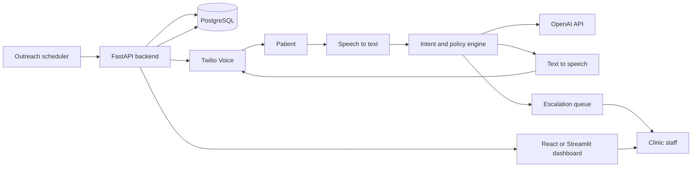

# AI Medical Voice Agent

AI Medical Voice Agent for Patient Outreach, Question Handling, and Feedback Collection.

This project is designed to help clinics reduce repetitive inbound and outbound call workload by automating appointment reminders, confirmations, rescheduling intent capture, approved administrative question handling, refill routing, and patient feedback collection. The system reads patient records from a clinic database, places outbound calls, understands patient responses, updates call outcomes in the system, and escalates complex or clinically sensitive cases to staff.

## Core boundaries

- Supports administrative patient outreach and approved non-clinical questions
- Must not provide diagnosis, emergency advice, medication dosage changes, or clinical recommendations
- Escalates unsupported or high-risk cases to clinic staff

## Architecture at a glance



## Recommended GitHub structure

```text
clinic-agent/
|- backend/
|- frontend/
|- tests/
|- docs/
|- infra/
|- scripts/
|- .env.example
|- docker-compose.yml
|- README.md
```

## Tools Used

- `Python` for backend orchestration and workflow logic
- `FastAPI` for API endpoints, webhooks, and service structure
- `PostgreSQL` for patient, appointment, call outcome, feedback, and escalation data
- `Twilio` for outbound calling and telephony integration
- `OpenAI API` for intent analysis, response generation, and voice testing
- `Speech-to-text` for converting patient speech into structured text inputs
- `Text-to-speech` for speaking back to patients in a natural voice
- `React` or `Streamlit` for the clinic staff dashboard
- `Docker` and `docker-compose` for local development and deployment setup
- `Git` and `GitHub` for version control, collaboration, and publishing
- `Mermaid` for architecture and workflow diagrams in project documentation

## Key documentation

- [Architecture](docs/ARCHITECTURE.md)
- [Architecture Diagram](docs/ARCHITECTURE_DIAGRAM.md)
- [GitHub Project Structure](docs/GITHUB_PROJECT_STRUCTURE.md)
- [Why These Tools - Interview Notes](docs/WHY_THESE_TOOLS.md)
- [QA Test Strategy](docs/QA_TEST_STRATEGY.md)
- [Voice Test](docs/VOICE_TEST.md)
- [LinkedIn Post With Diagram](docs/LINKEDIN_POST.md)
