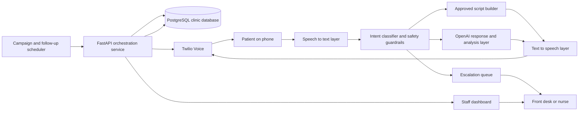

# Architecture

## Goal

Build an AI medical voice agent that can:

- read patients from a clinic database
- place outbound calls
- verify basic identity details
- support approved administrative conversations
- collect outcomes and feedback
- escalate complex or clinical cases to staff

## High-level architecture

For a cleaner standalone diagram, see [ARCHITECTURE_DIAGRAM.md](ARCHITECTURE_DIAGRAM.md).

## Main components

### 1. Outreach scheduler

Selects patients with upcoming appointments or pending follow-ups and creates call jobs.

### 2. FastAPI backend

Acts as the orchestration layer for call workflows, patient lookup, intent handling, result logging, escalation routing, and dashboard APIs.

### 3. Telephony layer

Twilio places the outbound call, streams or receives voice input, and returns call events and callbacks.

### 4. Speech pipeline

Speech-to-text converts patient speech into text, while text-to-speech renders the system response back into voice.

### 5. Intent and safety layer

This is the control point that decides:

- whether the patient wants to confirm, reschedule, ask a question, or leave feedback
- whether the response is inside the approved administrative scope
- whether the conversation should be escalated

### 6. OpenAI response layer

Used for intent analysis and response generation inside tightly controlled boundaries, with approved scripts and escalation rules layered around it.

### 7. Database

Stores patient and operational data such as:

- patient ID
- name and phone number
- appointment date and time
- provider name
- visit type
- preferred language
- call status
- feedback score
- escalation flag
- last contact date

### 8. Dashboard

Used by clinic staff to review:

- call outcomes
- confirmations
- reschedule requests
- escalations
- feedback trends

## Suggested request flow

1. Scheduler selects patients from PostgreSQL.
2. FastAPI creates outbound call jobs.
3. Twilio places the call.
4. The system verifies basic identity information.
5. Patient speech is converted to text.
6. Intent and safety rules classify the request.
7. The system either:
   - answers within approved administrative scope
   - collects confirmation or feedback
   - routes the case to staff
8. Call outcome and transcript metadata are logged.
9. Dashboard updates for staff follow-up.

## QA-critical risk points

- wrong patient or wrong appointment context loaded into a call
- speech recognition failure causing wrong intent capture
- unsupported clinical questions answered instead of escalated
- call outcome logged incorrectly in the dashboard
- telephony callbacks or retries creating duplicate or missing updates
- PHI exposed more broadly than required for the task

## Recommended architecture principles

- keep business workflow rules outside raw prompts
- use explicit guardrails for non-supported clinical topics
- version prompts, scripts, and escalation rules
- trace each call with a correlation ID across all services
- make failure states observable, not silent
- design for safe fallback when AI or speech confidence is low
