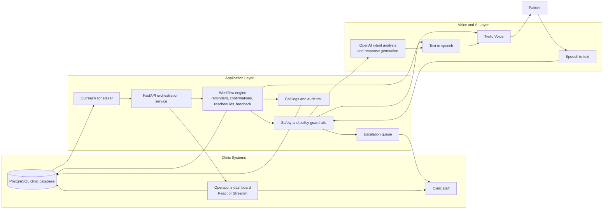

# Architecture Diagram

## Detailed system diagram

## Main flow

1. The scheduler selects patients with upcoming appointments or pending follow-ups from PostgreSQL.
2. FastAPI starts the outreach workflow and sends the call request to Twilio.
3. The patient answers the call and speaks with the voice agent.
4. Speech-to-text converts the response into text.
5. Guardrails classify intent, enforce policy, and decide whether AI can answer or the case must be escalated.
6. OpenAI helps generate a bounded administrative response.
7. Text-to-speech renders the reply back to the patient through Twilio.
8. The workflow stores call outcomes, feedback, and escalation details in the database.
9. Staff review results and follow-ups in the dashboard.

## Critical control points

- identity verification before discussing appointment details
- administrative-only response boundaries
- escalation for diagnosis, emergency, dosage, or other clinical requests
- reliable call outcome logging and dashboard visibility
- end-to-end traceability across telephony, AI, workflow, and database layers
