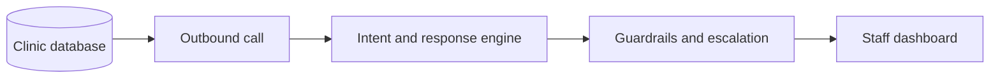

# LinkedIn Post With Diagram

## Post draft

I recently worked on the design of an **AI Medical Voice Agent** focused on patient outreach, administrative question handling, and feedback collection for clinics.

The idea was simple, but the execution needed to be very deliberate: reduce the repetitive call burden on clinic teams without compromising safety, patient trust, or operational control.

The system reads patient records from the clinic database, places outbound reminder and follow-up calls, helps patients confirm or reschedule appointments, answers approved administrative questions, captures feedback, and updates the dashboard so staff can review outcomes and take action where needed.

What mattered most to me in this kind of project was not just whether the AI could respond. It was whether the full workflow was reliable and safe in a real healthcare setting.

That meant designing for:

- clear administrative-only boundaries
- safe escalation of clinical or urgent concerns
- reliable speech and intent handling
- traceable call outcomes for staff review
- strong QA coverage across telephony, AI behavior, backend workflows, and dashboard visibility

For me, this is where senior QA and delivery leadership really matters. The value is not only in shipping an AI feature. It is in building a system that is practical, testable, safe, and ready to support real operations.

## Tech stack section for LinkedIn

Built with `Python`, `FastAPI`, `PostgreSQL`, `Twilio`, `OpenAI API`, speech-to-text, text-to-speech, `React` or `Streamlit`, `Docker`, and a QA strategy centered on safety boundaries, AI evaluations, telephony reliability, and end-to-end workflow coverage.

## Alternate tech stack wording

Tech stack: Python, FastAPI, PostgreSQL, Twilio, OpenAI API, STT/TTS, React or Streamlit, Docker, GitHub, and a QA-first delivery model focused on safety, observability, and reliable escalation handling.

## Simple diagram for the post

## Shorter version

I recently worked on an **AI Medical Voice Agent** designed to help clinics manage repetitive patient outreach more efficiently. The system reads patient records, places reminder and follow-up calls, captures confirmations or reschedule requests, answers approved administrative questions, collects feedback, and escalates complex or clinical cases to staff. What made the work meaningful was not just the AI itself, but designing the workflow to be safe, testable, and operationally reliable enough for real healthcare use.
